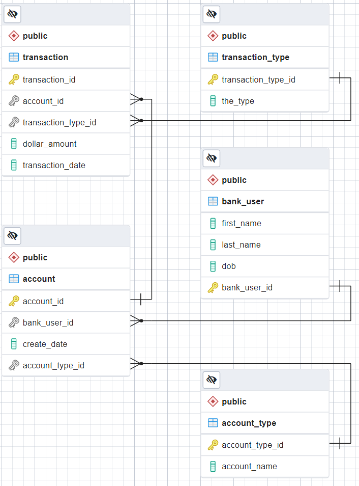

# JavaScript Express API Postgres 2 Assignments

We will build an Express that connects to a Postgres database. The web API will contain 10 endpoints and model a Bank.  Each exercise corresponds to an API endpoint.  For example:

```
GET http://localhost:5150/ex1/account-types/
GET http://localhost:5150/ex2/transaction-types/
GET http://localhost:5150/ex3/users?dobFilterYear=1972
...
```

Run the `SQL\create-banking-db.sql` script in a local Postgres database and be sure to update/create `postgres-pool.js` to connect to this banking database.  This script creates the following database:



```
const { Pool } = require("pg");

exports.pool = new Pool({
    user: "postgres",
    password: "xxxxx", // <== Replace with your password.
    database: "Bankiung", // <=== Check database name.
    host: "localhost",
    port: 5432,
  });

```

Create a collection with [Thunder Client](https://www.thunderclient.com/) and test every API endpoint.


# Ex. 1 Get All Account Types
Create the following API endpoint:

```
Method: GET
URL:  http://localhost:5150/ex1/account-types/
BODY: None
```

This endpoint returns ALL the account types from the `account_type` table:

Output:

```
[
  {
    "account_type_id": 1,
    "account_name": "checking"
  },
  {
    "account_type_id": 2,
    "account_name": "savings"
  },
  {
    "account_type_id": 3,
    "account_name": "retirement"
  }
]
```

# Ex. 2 Get Transaction Types
Create the following API endpoint:

```
Method: GET
URL:  http://localhost:5150/ex3/users?dobFilterYear=1972
BODY: None
```

This endpoint returns ALL the users that have been born after the year 1972.

Output:

```
[
  {
    "transaction_type_id": 1,
    "the_type": "deposit"
  },
  {
    "transaction_type_id": 2,
    "the_type": "withdraw"
  }
]
```

# Ex. 3 Get Users
Create the following API endpoint:

```
Method: GET
URL:  http://localhost:5150/ex3/users?dobFilterYear={year}
BODY: None
```

Where  `year` is a variable such as 1970.  This endpoint returns all the users that have been born after the year specified in the Url.

Output:
`http://localhost:5150/ex3/users?dobFilterYear=1972`

```
[
  {
    first_name: 'Bob',
    last_name: 'Marley',
    dob: 1975-01-29T05:00:00.000Z,
    bank_user_id: 2
  },
  {
    first_name: 'Charlies',
    last_name: 'Daniels',
    dob: 1973-08-29T04:00:00.000Z,
    bank_user_id: 3
  }
]
```

# Ex. 4 Get Accounts for User
Create the following API endpoint:

```
Method: GET
URL:  http://localhost:5150/ex4/users/{bankUserId}/accounts
BODY: None
```

This endpoint returns all the accounts for the `bankUserId` specified in the Url.

Output:
`http://localhost:5150/ex4/users/1/accounts`
```
[
  {
    "account_id": 1,
    "account_name": "checking"
  },
  {
    "account_id": 2,
    "account_name": "savings"
  },
  {
    "account_id": 3,
    "account_name": "retirement"
  }
]
```

# Ex. 5 Get Transactions for Date Range
Create the following API endpoint:

```
Method: GET
URL:  http://localhost:5150/ex5/transactions?startDate={startDate}&endDate={endDate}
BODY: None
```

This endpoint returns all the transactions from the `transaction` table that fall in the specified date range, ordered by date ascending.

Output:
`http://localhost:5150/ex5/transactions?startDate=3/1/2022&endDate=4/1/2022`
```
[
  {
    "transaction_id": 16,
    "account_id": 3,
    "transaction_type_id": 1,
    "dollar_amount": "$30.00",
    "transaction_date": "2022-03-01T05:00:00.000Z"
  },
  {
    "transaction_id": 17,
    "account_id": 3,
    "transaction_type_id": 1,
    "dollar_amount": "$30.00",
    "transaction_date": "2022-03-02T05:00:00.000Z"
  },
  {
    "transaction_id": 18,
    "account_id": 3,
    "transaction_type_id": 1,
    "dollar_amount": "$30.00",
    "transaction_date": "2022-03-03T05:00:00.000Z"
  },
  {
    "transaction_id": 11,
    "account_id": 5,
    "transaction_type_id": 1,
    "dollar_amount": "$100.00",
    "transaction_date": "2022-03-04T05:00:00.000Z"
  },
  {
    "transaction_id": 19,
    "account_id": 3,
    "transaction_type_id": 2,
    "dollar_amount": "$3.00",
    "transaction_date": "2022-03-04T05:00:00.000Z"
  }
]
```

# Ex. 6 Get Account Balance
This one is a doozie.

Database views provide an abstraction over our data.  Views help us by combining many tables into one virtual table and allow us to see related data easier.  Views essentially flatten (denormalize) our data making it easy for us to understand. Create a view called `view_transactions` that joins the following tables:

- transaction
- transaction_type
- account
- bank_user
- account_type

```
create view view_transactions as
    select 
        t.transaction_id,
        t.account_id,
        t.transaction_type_id,
        t.dollar_amount,
        bu.bank_user_id,
        bu.first_name,
        bu.last_name,
        bu.dob,
        t.transaction_date,
        tt.the_type,
        at.account_name
    from transaction t
        join transaction_type tt TODO...
        join account TODO...
        join bank_user TODO...
        join account_type TODO...

```

Once the view has been created, we can query the view as if it were a database table (e.g. `select * from view_transactions`).

Create the following API endpoint:

```
Method: GET
URL:  http://localhost:5150/ex6/account/{accountId}/balance
BODY: None
```

This endpoint returns the account balance and the name of the account for the account id specified in the Url:

Output:
`http://localhost:5150/ex6/accounts/1/balance`
```
{ balance: '$29.00', account: 'checking' }
```

The currency formatter has been included in this project:

```
let retval = currencyFormatter.format(balance, { code: 'USD' });
```

# Ex 7. Get Transactions for Range
Use the view that was created in exercise 6 to create the following endpoint:

```
Method: GET
URL:  http://localhost:5150/ex6/account/{accountId}/transactions?startDate={startDate}&endDate={endDate}
BODY: None
```

This endpoint returns the transactions for that account id specified and for the date range specified in ascending order.

Output:
http://localhost:5150/ex7/accounts/1/transactions?startDate=1/1/2022&endDate=3/1/2022
```
[
  {
    transaction_id: 1,
    dollar_amount: '10.00',
    transaction_date: 2022-01-01T05:00:00.000Z,
    the_type: 'deposit'
  },
  {
    transaction_id: 2,
    dollar_amount: '10.00',
    transaction_date: 2022-01-02T05:00:00.000Z,
    the_type: 'deposit'
  },
  {
    transaction_id: 3,
    dollar_amount: '10.00',
    transaction_date: 2022-01-03T05:00:00.000Z,
    the_type: 'deposit'
  },
  {
    transaction_id: 4,
    dollar_amount: '1.00',
    transaction_date: 2022-01-04T05:00:00.000Z,
    the_type: 'withdraw'
  }
]

```

# Ex 8. Post Transaction
Create the following API endpoint:

```
Method: GET
URL:  http://localhost:5150/ex8/accounts/{accountId}/transactions
BODY: 
  {
    "transactionTypeId": {1 or 2},
    "dollarAmount": <number>,
    "transactionDate": <string>
  }
```

This endpoint posts a new transaction to the transactions table and returns the id of the newly inserted row.

```
{ transaction_id: 22 }
```

