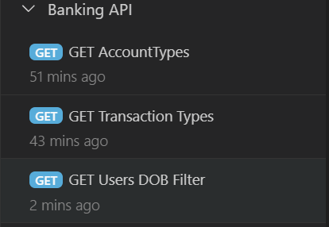

# JavaScript Express API Postgres Assignments

We will build an Express that connects to a Postgres database. The web API will contain 10 endpoints and model a Bookstore.  Each exercise corresponds to an API endpoint.  For example:

```
GET http://localhost:5150/ex1/persons/
GET http://localhost:5150/ex3/persons/1
GET http://localhost:5150/ex2/persons/1?type=person
...
```

Be sure to run the `SQL\create-bookstore-db.sql` script to create the tables and data that this API will consume.

Use [Thunder Client](https://www.thunderclient.com/) to test your endpoints.



# Ex. 1 Get All People
Create the following API endpoint:

```
Method: GET
URL:  http://localhost:5150/ex1/persons/
BODY: None
```

This endpoint returns ALL the people from the `person` table:

Example output:

```
[
  {
    "person_id": 1,
    "person_type_id": 1,
    "book_store_id": 1,
    "first_name": "Alice",
    "last_name": "Jones",
    "dob": "1970-08-29T04:00:00.000Z"
  },
  {
    "person_id": 2,
    "person_type_id": 1,
    "book_store_id": 2,
    "first_name": "Bob",
    "last_name": "Marley",
    "dob": "1975-02-15T05:00:00.000Z"
  },
  ...
```

# Ex. 2 Get Person With ID
Create the following API endpoint:

```
Method: GET
URL:  http://localhost:5150/ex1/persons/{id}
BODY: None
```

This endpoint returns all the information for a particular person from the `person` table.

Example Output for  http://localhost:5150/ex1/persons/1: 
```
{
  "person_id": 1,
  "person_type_id": 1,
  "book_store_id": 1,
  "first_name": "Alice",
  "last_name": "Jones",
  "dob": "1970-08-29T04:00:00.000Z"
}
```

# Ex. 3 Get All People for Type
Create the following API endpoint:

```
Method: GET
URL:  http://localhost:5150/ex1/persons?personType={Cashier|Manager|Stock%20Person}
BODY: None
```

This endpoint returns all of the types of people for the specified type. This endpoint must join the `person_type` and `person` tables.

Example Output for  http://localhost:5150/ex1/persons?personType=Manager: 
```
[
  {
    "person_id": 8,
    "person_type_id": 3,
    "book_store_id": 3,
    "first_name": "Harry",
    "last_name": "Chapmin",
    "dob": "1980-06-09T04:00:00.000Z",
    "person_type": "Stock Person"
  },
  {
    "person_id": 10,
    "person_type_id": 3,
    "book_store_id": 3,
    "first_name": "Kim",
    "last_name": "Weldon",
    "dob": "1970-11-08T05:00:00.000Z",
    "person_type": "Stock Person"
  },
  {
    "person_id": 9,
    "person_type_id": 3,
    "book_store_id": 3,
    "first_name": "John",
    "last_name": "Grow",
    "dob": "1988-10-08T04:00:00.000Z",
    "person_type": "Stock Person"
  }
]
```

# Ex. 4 Get Books
Create the following API endpoint:

```
Method: GET
URL:  http://localhost:5150/ex1/books/
BODY: None
```

This endpoint returns ALL the books from the `book` table:

Example output:

```
[
  {
    "book_id": 1,
    "title": "Relentless",
    "isbn": "111-1-11-11111-1"
  },
  {
    "book_id": 2,
    "title": "Alice in Wonderland",
    "isbn": "222-2-22-22222-2"
  },
  {
    "book_id": 3,
    "title": "Do Androids Dream of Electric Sleep",
    "isbn": "333-3-33-33333-3"
  },
  ...
```

# Ex. 5  Get Book for ID
Create the following API endpoint:

```
Method: GET
URL:  http://localhost:5150/ex1/books/{id}
BODY: None
```

This endpoint returns all the information for a specific book.

Example output:

```
{
"book_id": 1,
"title": "Relentless",
"isbn": "111-1-11-11111-1"
}
```

# Ex. 6

# Ex. 7

# Ex. 8

# Ex. 9

# Ex. 10
